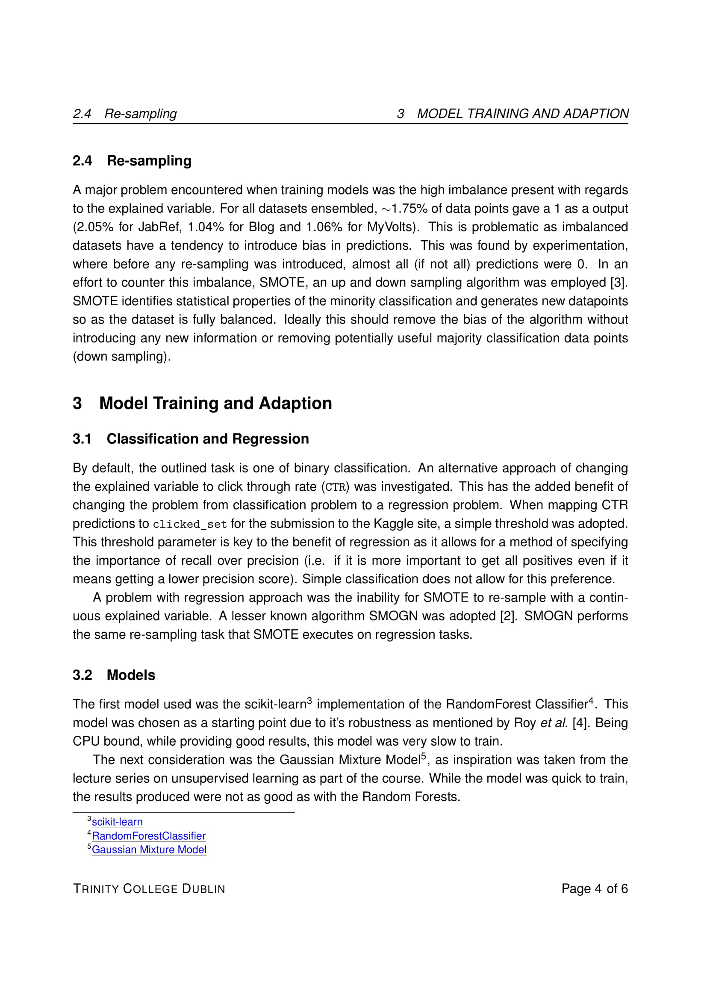

# Team 66 ALGORITHM CLICK PREDICTION PROJECT
Repo for Kaggle Group Project of Recommender Alogorithm Click Prediction, as seen [here](https://www.kaggle.com/c/tcd-ml-comp-201920-rec-alg-click-pred-group/overview)
<object data="https://gitlab.scss.tcd.ie/team_66_CS7CS4/Click_Predict/blob/dev1/ML_report.pdf" type="application/pdf" width="700px" height="700px">
    <embed src="https://gitlab.scss.tcd.ie/team_66_CS7CS4/Click_Predict/blob/dev1/ML_report.pdf">
        
Please download the report PDF here: <a href="https://gitlab.scss.tcd.ie/team_66_CS7CS4/Click_Predict/blob/dev1/ML_report.pdf">Download PDF</a>.

    </embed>
</object>

_________________

_________________

_________________

_________________

_________________

